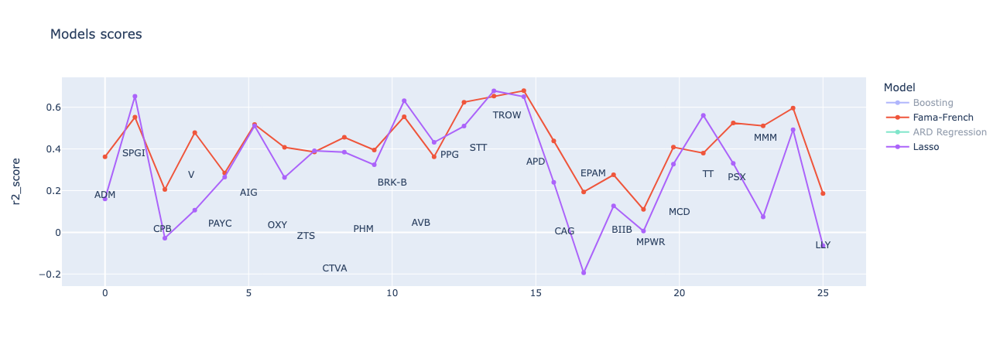
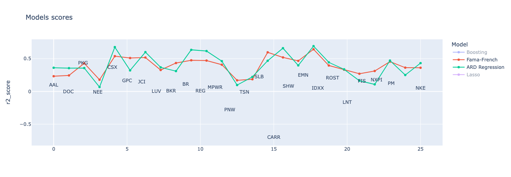
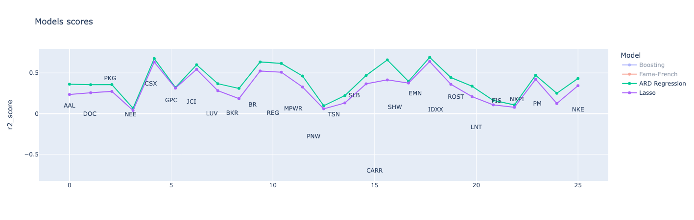
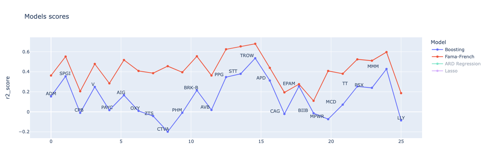

# Fama French Models

Study of Fama-French stock return models using data from the S&P 500.

<!-- ## Learn

- [arch](https://github.com/bashtage/arch/): ARCH, GARCH
- [statsmodels](https://www.statsmodels.org/stable/index.html)

## Check

- https://github.com/helske/walker -->

## Linear models

- CAPM
- Fama-French 3-factor model
- Fama-French-Carhart 4-factor model
- Fama-French 5-factor model

## Nonlinear methods

- Gradient Boosting
- Lasso and Ridge regressions
- ARD regression
- MLNN
- LSTM

## Feature selection methods

- sklearn feature importance
- boosting feature importance

## Models

A comparison was made of various models with the Fama-French model.

### Lasso vs 5-factor Fama-French

### ARD Regression vs 5-factor Fama-French

### ARD vs Lasso

### Gradient Boosting vs 5-factor Fama-French

